# Guia de uso: Point do Frango

Manual de operação do sistema de frente de caixa, comandas, cozinha, estoque e financeiro do Point do Frango. Destinado ao treinamento de atendentes, equipe de cozinha e dono.

Os nomes de botões e telas citados aqui são os nomes padrão. O dono pode renomear os itens do menu lateral em Config., seção Nomes do menu.

Valores em reais são digitados no formato brasileiro, com vírgula: `16,00`, `0,300`, `1.500,50`.

---

## 1. Acesso e perfis

### Entrar no sistema

1. Abra o endereço do sistema no navegador do computador, tablet ou celular.
2. Preencha **Usuário** e **Senha**. Para conferir a senha digitada, mantenha pressionado o botão do olho ao lado do campo; ao soltar, ela volta a ficar oculta.
3. Marque **Manter conectado neste aparelho** apenas em aparelhos de uso exclusivo da loja.
4. Clique em **Entrar**.

Se aparecer o aviso "Caps Lock está ativado", desligue a tecla antes de digitar a senha. No celular, o botão **Instalar app** (no rodapé do menu) coloca o sistema na tela inicial como um aplicativo. Para encerrar a sessão, use **Sair**.

### O que cada perfil vê

| Perfil | Menus disponíveis | Tela inicial |
|---|---|---|
| Administrador (dono) | PDV, Comandas, Cozinha, Pedidos, Entregas, Caixa, Clientes, Estoque, Cardápio, Financeiro, Config. | PDV |
| Atendente | PDV, Comandas, Cozinha, Pedidos, Entregas, Caixa, Estoque | PDV |
| Cozinha | Cozinha | Cozinha |

Diferenças importantes para o Atendente:

- Não vê custos, lucro, taxas nem a divisão do dinheiro.
- Não cancela pedidos nem comandas.
- No Estoque, apenas consulta saldos, usa **Rende**, **Extrato** e registra **Consumo da equipe**.
- No Caixa, fecha o caixa sem ver o valor esperado (fechamento cego).
- Não tem a forma de pagamento **Cortesia** no PDV.

Usuários são criados pelo dono em Config., seção Usuários.

---

## 2. Rotina do dia: abrir o caixa

Antes da primeira venda:

1. Acesse **Caixa**.
2. Conte o dinheiro que está na gaveta para troco.
3. Informe o valor em **Troco na gaveta (R$)**. Pode ser zero.
4. Clique em **Abrir caixa**.

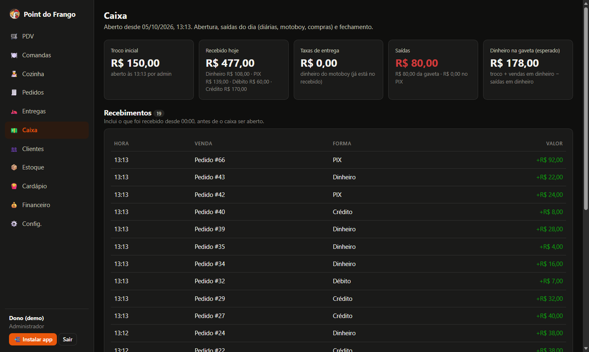

Com o caixa aberto, a mesma tela oferece:

- **Pagar diária**: escolha o funcionário (o valor da diária cadastrada já vem preenchido), ajuste se necessário, escolha **Pago em** (Dinheiro ou PIX) e clique em **Registrar pagamento**.
- **Pagar motoboy**: abre a tela Entregas (ver seção 6).
- **Outra saída**: registra uma retirada. Escolha o **Tipo** (compra de insumos, funcionário, pró-labore, equipamento, sangria ou outro), o **Valor**, a **Descrição** e, se quiser, o **Fornecedor / mercado**. Clique em **Registrar saída**.
- **Suprimento**: registra dinheiro colocado na gaveta (por exemplo, troco trazido do cofre).

Todos os lançamentos aparecem na lista **Saídas e suprimentos**. Somente o dono pode remover um lançamento.

---

## 3. Lançar pedido no PDV

A tela **PDV** (Frente de caixa) mostra o cardápio por categoria. Cada produto indica o preço e quantas unidades ainda é possível fazer com o estoque ("dá para fazer N"). Produtos sem insumo suficiente aparecem como **Sem estoque** e ficam bloqueados.

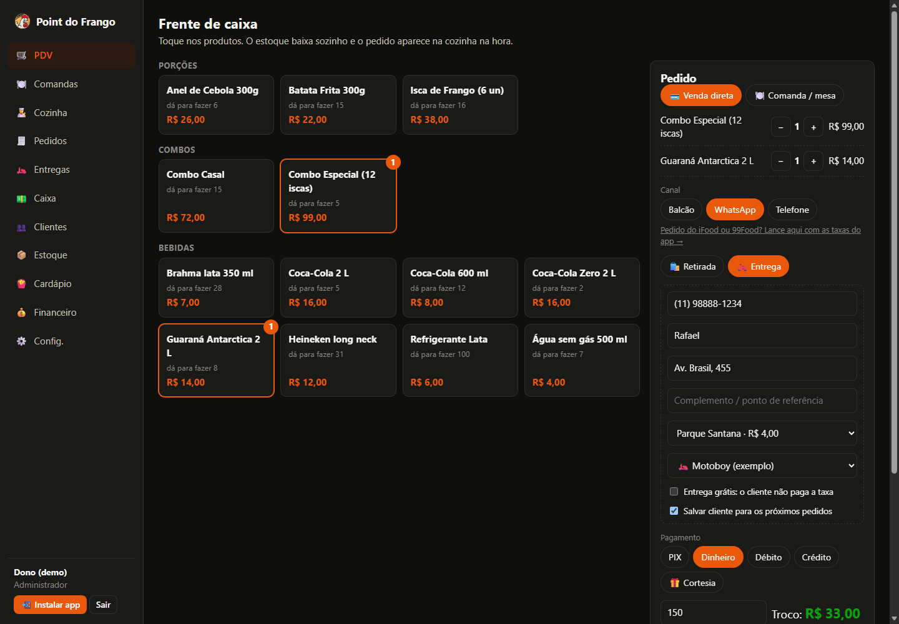

### Venda no balcão

1. Confirme que **Venda direta** está selecionado.
2. Toque nos produtos. Cada toque adiciona uma unidade; use os botões **−** e **+** na lista do pedido para ajustar.
3. Em **Canal**, mantenha **Balcão**.
4. Em **Pagamento**, escolha PIX, Dinheiro, Débito ou Crédito.
5. Em dinheiro, informe em **Cliente entregou (R$)** o valor recebido. O sistema mostra o troco ou quanto falta.
6. Se necessário, preencha **Observação para a cozinha** (por exemplo, "sem molho").
7. Clique em **Lançar pedido**.

Após o lançamento, o quadro do último pedido mostra o número, o valor e o troco. O botão **Cupom** imprime o comprovante. Pedidos formados só por itens que não passam pela cozinha (bebidas, em geral) já saem como entregues.

O botão **Limpar** esvazia o pedido em montagem.

### Pedido por WhatsApp ou telefone

1. Monte o pedido como no balcão.
2. Em **Canal**, escolha **WhatsApp** ou **Telefone**.
3. Escolha **Retirada** ou **Entrega**.
4. Digite o telefone em **Telefone / WhatsApp**. Se o cliente já tiver cadastro, nome, endereço e bairro são preenchidos e aparece a mensagem "Cliente encontrado".
5. Preencha **Nome do cliente** (obrigatório fora do balcão).
6. Para entrega, preencha também:
   - **Rua e número** e **Complemento / ponto de referência**;
   - **Bairro**, que define a taxa de entrega;
   - **Quem entrega**: um motoboy, **Eu mesmo (dono)** ou "definir depois".
7. Mantenha **Salvar cliente para os próximos pedidos** marcado para guardar o cadastro.
8. Escolha a forma de pagamento. Em dinheiro, informe em **Troco para (R$)** o valor que o cliente vai entregar; o sistema calcula quanto o motoboy deve levar de troco.
9. Clique em **Lançar pedido** e imprima a **Via do motoboy**, que traz endereço, telefone, valor a cobrar e troco.

Para entrega, telefone, endereço e bairro são obrigatórios. O resumo do pedido separa **Itens** e **Entrega**.

**Entrega grátis**: marque a opção para que o cliente não pague a taxa. Nos dias configurados pelo dono, ela já vem marcada. Se um motoboy fizer a entrega grátis, a loja paga a taxa a ele.

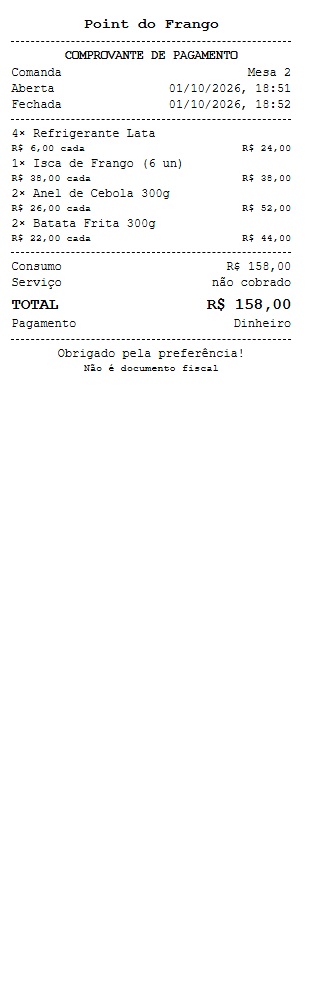

### Promoções e brindes

Quando o pedido atende a uma promoção ativa no dia (por exemplo, "comprou um combo, ganha um refrigerante"), aparece o quadro **Promoção do dia: dar o brinde**, com o item e a quantidade. O brinde é incluído automaticamente com preço zero. Para não dar o brinde, desmarque a opção antes de lançar.

### Cortesia (somente dono)

Para dar um pedido de graça:

1. Monte o pedido normalmente.
2. Em **Pagamento**, escolha **Cortesia**.
3. Informe para quem ou por qual motivo (campo obrigatório).
4. Clique em **Lançar pedido**.

O pedido vai para a cozinha e baixa o estoque, sem cobrar itens nem entrega. A lista fica em Estoque, botão **Cortesias**.

### Pedido em mesa a partir do PDV

Selecione **Comanda / mesa**, escolha a comanda na lista (ou crie com **+ Nova**), adicione os itens e clique em **Enviar para a cozinha**. O valor vai para a conta da mesa.

No celular, o pedido em montagem fica numa barra no rodapé; toque nela para abrir e em **Fechar** para voltar ao cardápio.

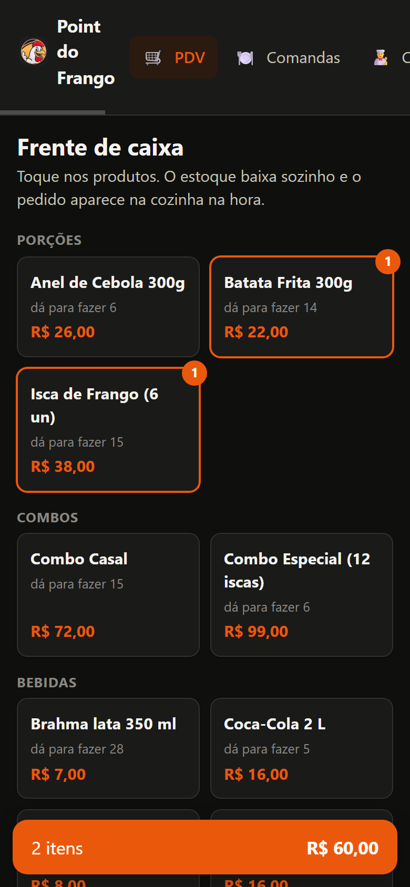

---

## 4. Mesas e comandas

### Abrir uma comanda

1. Acesse **Comandas** e clique em **+ Abrir comanda**.
2. Informe **Mesa ou nome do cliente** (por exemplo, "Mesa 4") e, se quiser, uma **Observação**.
3. Clique em **Abrir**.

Não é possível ter duas comandas abertas com a mesma identificação.

Cada comanda aberta mostra o tempo desde a abertura, a quantidade de pedidos, o aviso "na cozinha" quando há preparo em andamento, o consumo e o total com a taxa de serviço.

### Adicionar pedidos

1. No cartão da comanda, clique em **+ Pedido**. O PDV abre com a comanda já selecionada.
2. Adicione os itens e clique em **Enviar para a cozinha**.

Cada pedido baixa o estoque e vai para a cozinha na hora. O pagamento fica para o fechamento.

### Fechar a conta

1. No cartão da comanda, clique em **Conta** (ou, no PDV, em **Receber / fechar conta**).
2. Confira o consumo e a lista de pedidos.
3. Para mostrar a conta ao cliente antes do pagamento, use **Imprimir conferência**. O papel mostra o total com e sem a taxa de serviço.
4. Marque ou desmarque **Cobrar 10% de serviço (opcional para o cliente)**, conforme a decisão do cliente. O percentual exibido é o configurado pelo dono.
5. Escolha a **Forma de pagamento**. Em dinheiro, informe **Cliente entregou (R$)** para ver o troco.
6. Mantenha **Imprimir comprovante ao fechar** marcado se o cliente quiser o comprovante.
7. Clique em **Fechar conta**.

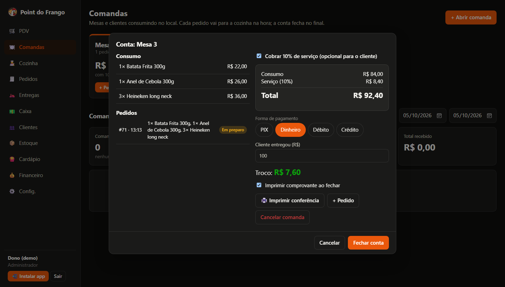

Somente o dono vê o botão **Cancelar comanda**, que exige um motivo, cancela todos os pedidos e devolve os insumos ao estoque.

### Comandas encerradas

Abaixo das comandas abertas fica o histórico, filtrável por **Hoje**, **7 dias**, **30 dias**, **Mês atual** ou por datas. Use **Ver** para os detalhes e o botão de impressora para reimprimir o comprovante.

---

## 5. Cozinha

A tela **Cozinha** é a fila de preparo. Pedidos novos aparecem automaticamente, vindos do balcão, das mesas ou de qualquer celular.

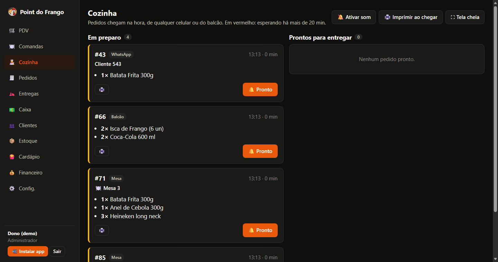

### Colunas e status

- **Em preparo**: pedidos aguardando ou em produção. O horário fica em vermelho quando o pedido espera há mais de 20 minutos.
- **Prontos para entregar**: pedidos finalizados, aguardando retirada, garçom ou motoboy.

Cada ticket mostra número, canal, nome da mesa ou do cliente, itens, brindes, observações e, em entregas, o bairro e o entregador. Pedidos de cortesia trazem a marca "cortesia".

### Operação

1. Ao terminar o preparo, clique em **Pronto**. O ticket passa para a coluna da direita.
2. Quando o pedido sair da cozinha, clique em **Entregue**. O ticket some da fila.
3. Se marcou **Pronto** por engano, use **Voltar**.

### Botões do topo

- **Ativar som**: toca um alerta a cada pedido novo. Quando ligado, o botão mostra **Som ligado**.
- **Imprimir ao chegar**: abre a impressão do ticket de cada pedido novo automaticamente. Quando ligado, mostra **Imprime sozinho**.
- **Tela cheia**: ocupa toda a tela do aparelho.

Essas preferências ficam gravadas no aparelho. Para imprimir um ticket específico, use o botão de impressora no próprio ticket. O ticket da cozinha não traz valores.

---

## 6. Entregas e acerto do motoboy

A tela **Entregas** reúne as entregas do dia, o pagamento dos motoboys e as taxas por bairro.

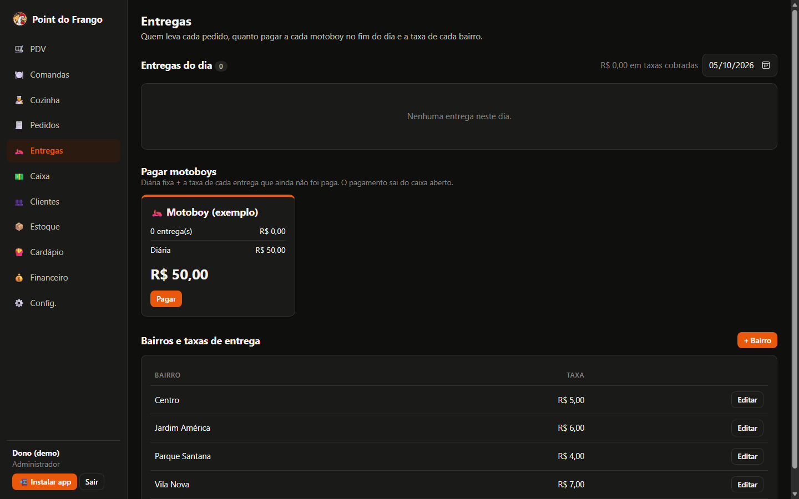

### Entregas do dia

A tabela mostra, para cada entrega: cliente, endereço, bairro, taxa, valor a cobrar, forma de pagamento, troco, motoboy e status. Use o campo de data para consultar outro dia.

- Para definir ou trocar quem entregou, escolha na coluna **Motoboy**. Entregas já pagas ao motoboy ou canceladas não podem ser alteradas.
- O botão de impressora reimprime a via do motoboy.
- As marcas "grátis" e "dono entregou" indicam, respectivamente, que o cliente não pagou a taxa e que a taxa ficou com a loja.

### Pagar o motoboy

A seção **Pagar motoboys** mostra um cartão por motoboy com as entregas ainda não pagas, a diária e o total.

1. Para conferir, clique em **Ver entregas**.
2. Clique em **Pagar**.
3. Mantenha ou desmarque a **Diária** (se já foi paga hoje, ela aparece bloqueada).
4. Escolha **Pago em**: Dinheiro ou PIX.
5. Clique em **Confirmar pagamento**.

O pagamento sai do caixa aberto e aparece em Caixa, na lista de saídas.

### Bairros e taxas

A tabela **Bairros e taxas de entrega** lista as taxas usadas no PDV. O dono cadastra com **+ Bairro** e altera com **Editar**; para suspender entregas em um bairro, desmarque **Entregamos neste bairro**.

---

## 7. Pedidos de iFood e 99Food

Pedidos dos aplicativos são lançados manualmente, durante o expediente ou no fim do dia, consultando o pedido ou o extrato do app.

1. Acesse **Pedidos** e clique em **+ Pedido iFood / 99Food**. O mesmo formulário abre pelo link "Pedido do iFood ou 99Food?" no PDV.
2. Escolha a plataforma: **iFood** ou **99Food**.
3. Informe o **Nº do pedido no app**, a **Data e hora** e, se quiser, o **Cliente**.
4. Em **Itens**, escolha cada produto e a quantidade. Use **+ Item** para mais linhas.
5. Confira **Valor do pedido no app (R$)**. Ele vem preenchido com o preço do cardápio; corrija se o preço no app for outro.
6. Se houve promoção paga pela loja, informe em **Promoção paga pela loja (R$)**.
7. Informe **Taxas que o app descontou (R$)** com o valor exato do extrato. Para o dono, o campo vem com uma sugestão baseada no percentual configurado.
8. Marque **Enviar para a cozinha** apenas se o pedido ainda vai ser preparado. Deixe desmarcado se ele já saiu.
9. Clique em **Lançar pedido**.

O resumo mostra o valor vendido, as taxas do app e o **Repasse** que cai na conta. Os insumos baixam do estoque pela ficha técnica. Esse valor não entra na gaveta do caixa.

A tela **Pedidos** também lista todos os pedidos do dia. O dono vê ainda as taxas, o lucro de cada pedido e o botão **Cancelar**, que exige motivo e devolve os insumos ao estoque.

---

## 8. Fechar o caixa

No fim do expediente:

1. Acesse **Caixa** e clique em **Fechar caixa**.
2. Conte todo o dinheiro da gaveta, notas e moedas.
3. Informe o total em **Dinheiro contado (R$)**.
4. Se houver algo a registrar, use **Observação**.
5. Clique em **Fechar caixa**.

Para o Atendente, o fechamento é cego: a tela não mostra as vendas, o valor esperado nem a diferença. A conferência fica com o dono.

O dono vê, durante o dia, o troco inicial, o recebido por forma de pagamento, as taxas de entrega, as saídas e o **Dinheiro na gaveta (esperado)**. No fechamento, o sistema exibe a diferença entre o contado e o esperado. Com o caixa fechado, o dono consulta o histórico em **Caixas anteriores**.

---

## 9. Funções exclusivas do dono

### Estoque: entrada de mercadoria e contagem

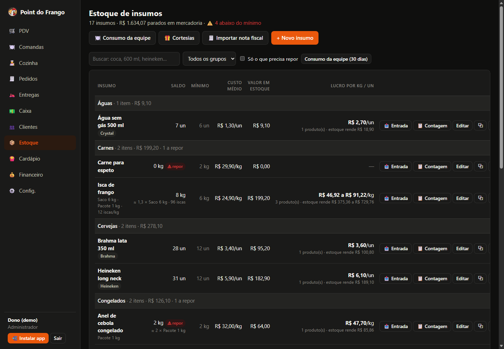

A tela **Estoque** lista os insumos por grupo, com saldo, mínimo, custo médio e valor em estoque. Use a busca, o filtro de grupo e **Só o que precisa repor** para localizar itens. Insumos abaixo do mínimo exibem a marca "repor".

**Registrar uma compra (Entrada):**

1. Na linha do insumo, clique em **Entrada**.
2. Em **Como chegou**, escolha a embalagem cadastrada (por exemplo, "Saco 2 kg") ou **Avulso**.
3. Informe a quantidade e o **Valor total pago (R$)**. O resumo mostra o novo saldo e o custo por unidade.
4. Em **Como foi pago**, escolha: PIX / conta (por fora do caixa), Dinheiro da gaveta (caixa aberto), Débito, Crédito ou Não lançar nas saídas.
5. Escolha o **Fornecedor / mercado**, se houver, e clique em **Registrar entrada**.

O custo médio do insumo é recalculado com o valor da compra. Pagamento com dinheiro da gaveta exige caixa aberto.

**Contagem (inventário):**

1. Clique em **Contagem** na linha do insumo.
2. Informe a **Quantidade contada** e o **Motivo** (por exemplo, "Inventário semanal").
3. Clique em **Ajustar saldo**. A diferença fica registrada no **Extrato** do insumo.

Outros botões da linha: **Editar** (dados, embalagens, mínimo, ativo), o botão de duplicar (cria um insumo parecido, como outro sabor ou tamanho), **Rende** (quantas porções o saldo permite fazer e, para o dono, o lucro por kg ou unidade) e **Extrato** (histórico de movimentações). Novos insumos são criados em **+ Novo insumo**.

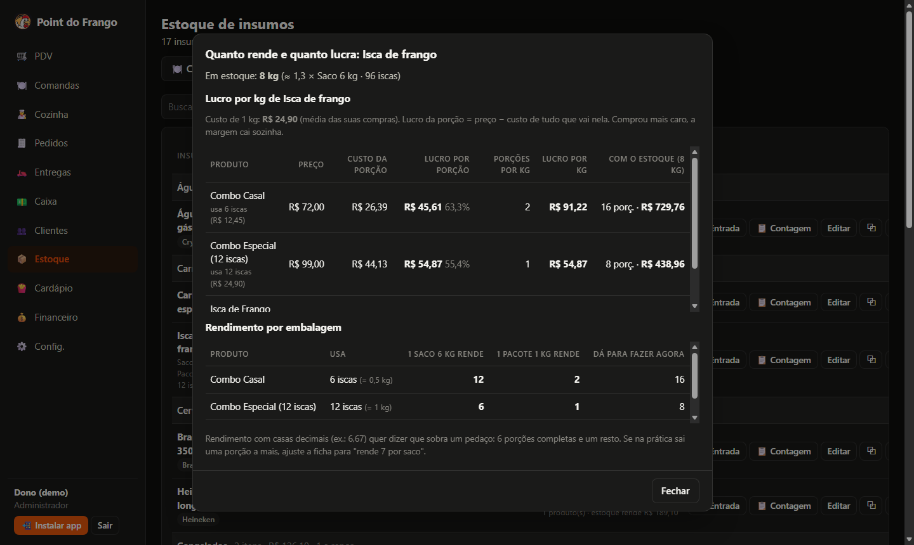

### Importar nota fiscal (NF-e)

1. Em **Estoque**, clique em **Importar nota fiscal**.
2. Opcionalmente, digite a **Chave de acesso da DANFE** (44 números) para conferir se a nota já foi importada.
3. Em **Arquivo XML da nota**, escolha o XML recebido por e-mail ou baixado no portal da nota fiscal.
4. Confira os dados da nota e os avisos: nota já importada, nota emitida para outro CNPJ ou XML diferente da chave digitada.
5. Para cada item, escolha o **Insumo do estoque** correspondente ou "não é estoque (ignorar)".
6. Ajuste **Unid. em cada**: um fardo com 6 unidades = 6; produto vendido por kg = 1.
7. Escolha **Como foi pago**. Se o pagamento já foi lançado, use **Já lancei o pagamento (não lançar de novo)**.
8. Clique em **Dar entrada no estoque**.

O sistema lembra as escolhas para a próxima nota do mesmo fornecedor.

### Consumo da equipe

Usado para retirar do estoque o que a equipe comeu ou bebeu, sem registrar venda. Também disponível para o Atendente.

1. Em **Estoque**, clique em **Consumo da equipe**.
2. Mantenha ou altere o **Motivo** (padrão: "Janta da equipe").
3. Escolha os itens: pratos do cardápio (em quantidade inteira, baixam pela ficha técnica) ou insumos avulsos.
4. Use **+ Item** para mais linhas e clique em **Tirar do estoque**.

O histórico fica em **Consumo da equipe (30 dias)**. O custo aparece em Financeiro, aba Saídas do mês.

### Cardápio e ficha técnica

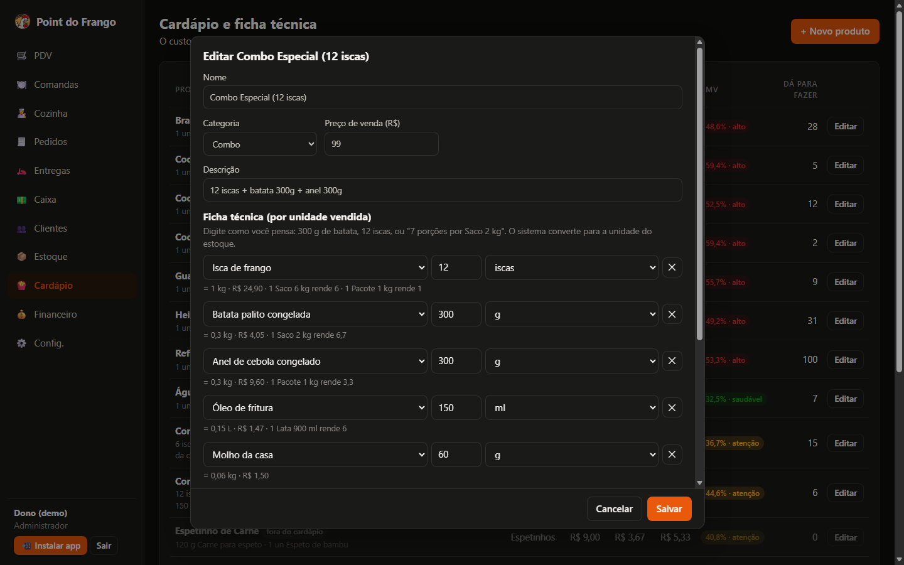

A tela **Cardápio** mostra, para cada produto, preço, custo, margem, CMV (classificado como saudável, atenção ou alto) e quantas unidades o estoque permite fazer.

1. Clique em **+ Novo produto** ou em **Editar**.
2. Preencha **Nome**, **Categoria**, **Preço de venda** e, se quiser, **Descrição**.
3. Em **Ficha técnica (por unidade vendida)**, adicione cada insumo com a quantidade e a unidade, como 300 g de batata, 12 iscas ou "7 porções por Saco 2 kg". Use **+ Insumo** para mais linhas.
4. Confira o resumo de custo, margem e CMV.
5. Mantenha **Vai para a cozinha** marcado para itens com preparo. Desmarque para bebidas.
6. Para tirar um produto do PDV sem apagá-lo, desmarque **Disponível no PDV**.
7. Clique em **Salvar**.

### Promoções

1. Em **Cardápio**, seção **Promoções com brinde**, clique em **+ Promoção**.
2. Informe o **Nome**, o produto em **Quem compra** e a quantidade, o produto em **Ganha** e a quantidade.
3. Marque os dias da semana em **Vale nos dias**.
4. Clique em **Salvar**.

Para pausar, edite e desmarque **Ativa**. Para remover, use **Excluir promoção**. O brinde sai do estoque com preço zero e o custo dele entra no lucro do pedido.

### Saídas do mês e contas por código de barras

Em **Financeiro**, aba **Saídas do mês**, ficam todas as despesas: as da gaveta e as pagas por fora (PIX, boleto, cartão).

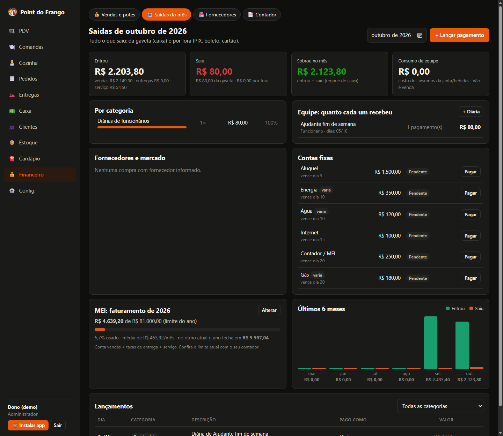

**Lançar um pagamento feito por fora da gaveta:**

1. Clique em **+ Lançar pagamento**.
2. Escolha **Categoria**, **Dia**, **Descrição**, **Valor** e **Pago com**.
3. Para diárias e salários, escolha a **Pessoa**; para compras, o **Fornecedor / mercado**.
4. Clique em **Salvar**.

Para lançar a diária de um dia anterior, use **+ Diária** no quadro da equipe. O que sai hoje da gaveta deve ser lançado na tela Caixa.

**Pagar uma conta fixa:**

1. No quadro **Contas fixas**, clique em **Pagar** na conta desejada.
2. Cole os números em **Código de barras ou linha digitável** ou, quando disponível, use o botão da câmera para ler o código. Valor e vencimento são preenchidos a partir do código.
3. Confira **Valor**, **Pago com** e **Dia**.
4. Clique em **Marcar como paga**.

A tela mostra ainda o total por categoria, o que cada pessoa da equipe recebeu, as compras por fornecedor, o acompanhamento do limite de faturamento do regime (MEI ou ME, ajustável em **Alterar**), o histórico de seis meses e quem ficou com as taxas de entrega. Lançamentos feitos por fora podem ser removidos ali; os feitos no caixa só pela tela Caixa.

A aba **Fornecedores** cadastra mercados, distribuidoras e prestadores com **+ Fornecedor**.

### Financeiro e potes

A aba **Vendas e potes** mostra, para o período escolhido (Hoje, 7 dias, 30 dias, Mês atual ou datas):

- faturamento bruto, ticket médio, lucro líquido e pró-labore do período;
- custo das cortesias e taxa de serviço das comandas, quando houver;
- **Divisão do dinheiro** entre os potes: Reposição de estoque, Contas da loja, Equipe e entregas, Seu pró-labore, Reserva de emergência e Taxas (maquininha e apps);
- **Contas do mês**: quanto já foi guardado frente ao total das contas fixas;
- **Estoque a repor**, faturamento por dia, mais vendidos, vendas por canal e por forma de pagamento.

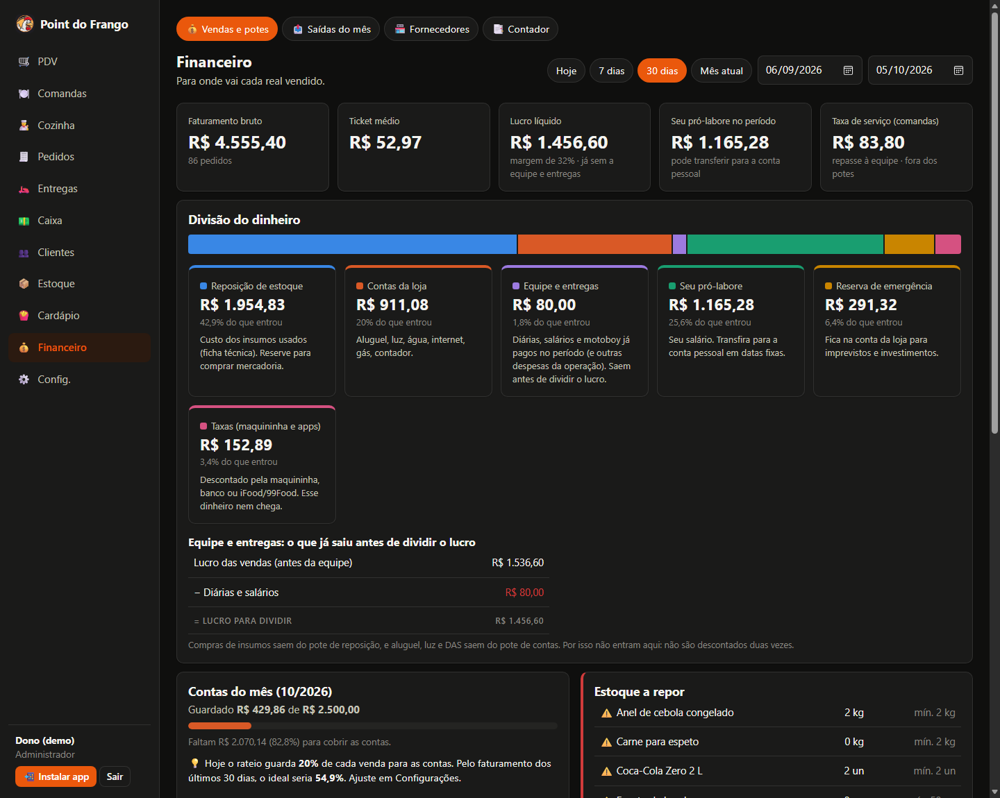

Quando as vendas não cobrem custos, contas e taxas, aparece um aviso de prejuízo.

### Relatório para o contador

Na aba **Contador**:

1. Escolha o período: **Mês passado**, **Este mês**, **Este ano**, **Ano passado (declaração)** ou meses específicos.
2. Confira receita bruta, despesas pagas, resultado e taxa de serviço repassada à equipe.
3. Use **Imprimir / salvar PDF** para gerar o relatório em folha A4.
4. Baixe as planilhas: **Receitas por dia**, **Todos os pedidos** e **Todas as saídas**. Os arquivos abrem no Excel e não contêm dados pessoais de clientes.

O relatório traz as receitas mês a mês e, para o ano anterior, os valores da declaração anual do MEI.

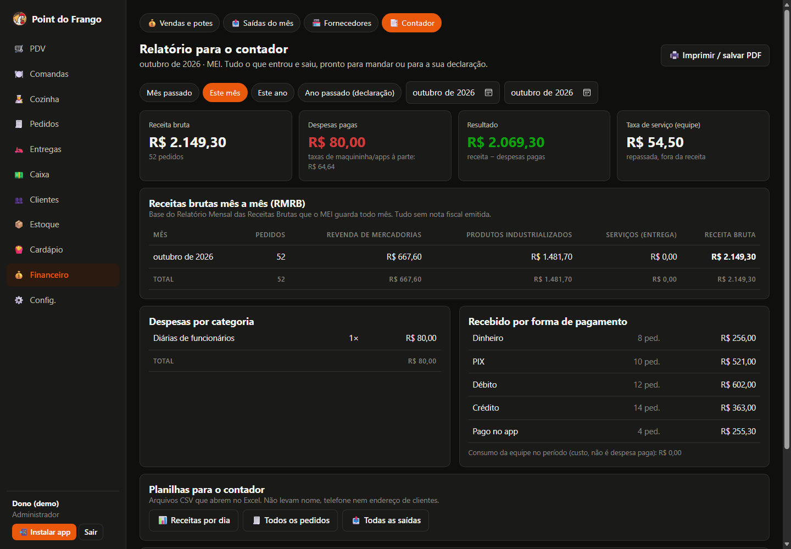

### Clientes e LGPD

A tela **Clientes** lista os clientes salvos nos pedidos por WhatsApp e telefone. Use a busca por nome ou telefone.

- **Editar**: altera nome, endereço, referência e bairro.
- **Apagar dados**: atende ao pedido do cliente para excluir seus dados.

Para excluir a pedido do cliente:

1. Localize o cliente pela busca.
2. Clique em **Apagar dados**.
3. Confirme em **Apagar definitivamente**.

O cadastro é excluído e os pedidos antigos ficam sem nome, telefone e endereço; os valores continuam no financeiro. A ação não pode ser desfeita. Clientes sem pedidos há mais de um ano são apagados automaticamente.

### Configurações

A tela **Config.** reúne:

- **Loja e cupom**: nome, CNPJ/CPF, telefone, endereço, mensagem no fim do cupom, percentual da taxa de serviço e se ela já vem marcada no fechamento da conta.
- **Impressora deste aparelho**: largura da bobina (80 mm ou 58 mm) e **Imprimir teste**. A escolha vale apenas para o aparelho em uso.
- **Rateio de cada venda**: percentuais de contas fixas e pró-labore, taxas de PIX, débito e crédito, e taxas sugeridas de iFood e 99Food. Vale para os próximos pedidos.
- **Contas fixas do mês**: aluguel, luz, DAS e outras, com valor, vencimento e opção de valor variável.
- **Equipe**: motoboys e funcionários com a diária de cada um.
- **Dias de entrega grátis**: dias da semana em que o PDV já marca a entrega grátis.
- **Nomes do menu**: nomes personalizados para o menu lateral.
- **Usuários**: criação de acessos (Atendente, Cozinha ou Administrador), desativação e **Trocar minha senha**.

---

## 10. Dúvidas comuns

**O caixa está fechado e preciso vender.**
O PDV mostra o aviso "O caixa de hoje ainda não foi aberto", mas permite lançar o pedido. Abra o caixa assim que possível pelo link **Abrir caixa** do aviso. O fechamento de conta de comanda também é aceito com o caixa fechado; o pagamento entra no caixa do dia quando ele for aberto. Compras pagas com dinheiro da gaveta exigem caixa aberto.

**Faltou insumo para um produto.**
O produto aparece como **Sem estoque** no PDV e não pode ser adicionado. Se a mercadoria chegou, o dono registra a **Entrada** no Estoque. Se o saldo do sistema está diferente do real, o dono faz a **Contagem**.

**O cliente pediu para apagar os dados.**
O dono acessa **Clientes**, localiza o cliente e usa **Apagar dados**, confirmando em **Apagar definitivamente**.

**Lancei um pedido errado.**
O Atendente não cancela pedidos. O dono cancela em **Pedidos**, botão **Cancelar**, informando o motivo; os insumos voltam ao estoque.

**O cliente não quer pagar os 10%.**
Na conta da comanda, desmarque **Cobrar 10% de serviço** antes de clicar em **Fechar conta**.

**Lancei uma saída de caixa errada.**
Somente o dono remove lançamentos, na lista **Saídas e suprimentos** da tela Caixa.

**A cozinha não ouve os pedidos novos.**
No aparelho da cozinha, clique em **Ativar som**. O navegador só libera o som após o primeiro toque na tela.

**A impressão sai cortada ou larga demais.**
Em Config., seção **Impressora deste aparelho**, escolha a largura da bobina (80 mm ou 58 mm) e use **Imprimir teste**.
